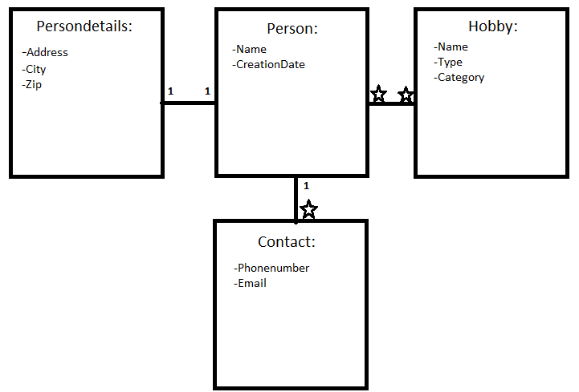
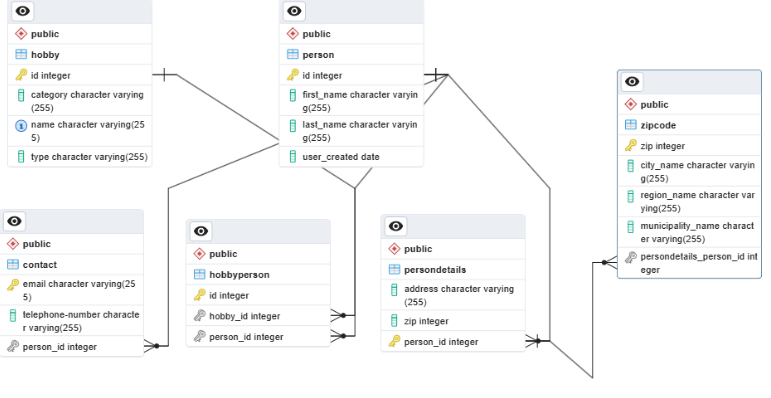
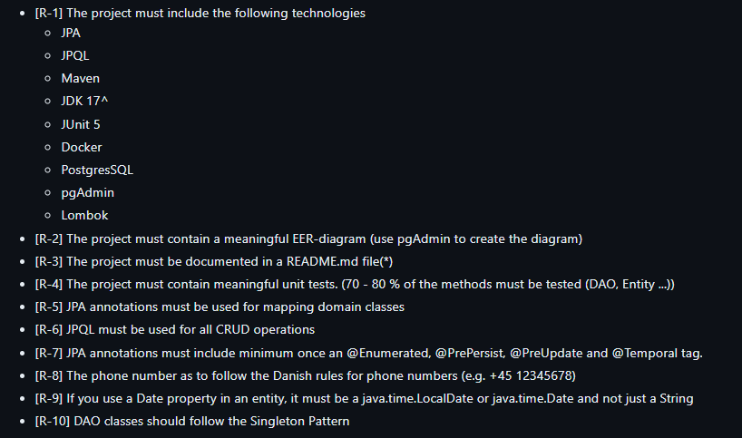

# Hobbies

[R-3.1] **A description of your business idea**

We would like to connect people with their chosen and favourite hobbies.
Our business has the option to find all member details through their phonenumber,
hobbies and other methods. (Don't worry, every user has to sign a waiver before signing up.)
This is all done with the help and use of a database.

[R-3.2] **A Domain Model of your business idea**

[R-3.3] **An EE-diagram of your database**

[R-3.4] **A group description of your group work and how you have collaborated (GIT, Trello, Discord, who did what, etc.)**

We have chosen to work together physically in the classroom every day from 10-15 and when we continue to work at home we discuss through our group discord channel. 
Thursday we didn't have the classroom available, so we sat at the end of the hallway. We've also used Github Desktop to commit to our project.

[R-3.5] **All technical requirements listed above under Project Requirements**

